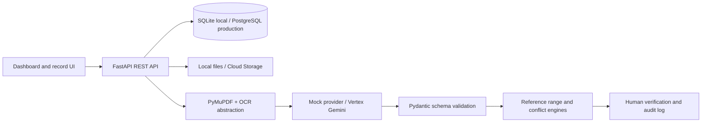

# Architecture

The application is deliberately local-first: patient browsing, uploads, source traceability, deterministic classification, editing, conflicts, timeline, search, and audit records remain available when cloud AI is unavailable.
